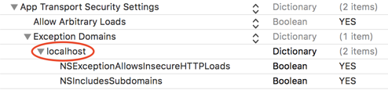

# SwiftLocalhost
Simple framework that creates a mock localhost server primarily used for XCUITest.
### Installation

##### [CocoaPods](http://cocoapods.org)

SwiftLocalhost is available through CocoaPods. To install it, simply add the following line to your Podfile:
```ruby
pod 'SwiftLocalhost'
```
## Under the hood
`Swiftlocalhost` uses [Criollo](https://github.com/thecatalinstan/Criollo) library as the in-memory web server. 

## How to use - Follow these 4 steps to setup
### 1. [Localhost] - pod install `SwiftLocalhost` to your XCUITest target.

There are 2 ways to create an instance of a Localhost.

Using a specific port number
```swift
LocalhostServer(portNumber: 9001)
```

Getting an instance with a random unused port number assigned to it. This is important if you want to execute your tests parallelly 
```swift
LocalhostServer.initializeUsingRandomPortNumber()
```

An example of how a XCTestCase class looks like
```swift
import SwiftLocalhost

class MovieListTest: XCTestCase {
    
    var localhostServer: LocalhostServer!
    
    override func setUp() {
        continueAfterFailure = false
        self.localhostServer = LocalhostServer.initializeUsingRandomPortNumber()
        self.localhostServer.startListening()
    }
    
    override func tearDown() {
        self.localhostServer.stopListening()
    }
}
```

### 2. [API] - Modify App API Requests with http://localhost:xxxx (where xxxx is port number)

If you are using a specific port for your localhost, you can simply change the domain to http://localhost:xxxx.
```swift
class NetworkOperations {

    //private let baseUrl: String = "https://api.themoviedb.org/3/movie"
    
    private let baseUrl: String = "http://localhost:9001/3/movie"
}
```

If you are using random port numbers in your tests, then you will need to pass the port information into your app as launch arguments.

```swift
//In Test Runner, pass the port information using launchArguments
let app = XCUIApplication()
app.launchArguments = ["port:\(self.localhostServer.portNumber)"]
app.launch()

//In Application - Read the ProcessInfo Arguments
ProcessInfo.processInfo.arguments
```

If you need to redirect 3rd party libraries (eg. Firebase, Google Analytics) to the localhost server, you can use [NetworkInterceptor](https://github.com/depoon/NetworkInterceptor) pod created by Kenneth Poon.

### 3. [Info.plist] - Modify App Info.plist
Since we will be using `http` protocol to communicate with our localhost server, we will need to add an exception domain for `localhost` in your Info.plist file.



You will also need to disable SSL Pinning if needed.

### 4. [Mock Responses] - Setup localhost server with mock responses.

You can setup specific mock response according to your test case needs. Set the `Data` instance of the response file as a response to a specific path that your test cases will be covering.

```swift
//let portNumber: UInt = 9001

//Binary of Mock Response Json File
//let jsonFileData: Data! 

self.localhostServer.get("/3/movie/popular", routeBlock: { request in
    let requestURL: URL = URL(string: "http://localhost:\(portNumber)/3/movie/popular")!
    let httpUrlResponse = HTTPURLResponse(url: requestURL, statusCode: 200, httpVersion: nil, headerFields: ["Content-Type":"application/json"])!
    return LocalhostServerResponse(httpUrlResponse: httpUrlResponse, data: jsonFileData)
})

```

You can queue up mock responses for the same route path. Mock responses will be returned in FIFO order. Used responses will be removed from the queue unless there is only 1 response left in the queue.

```swift

var dataResponse1, dataResponse2, dataResponse3: Data!

self.localhostServer.route(method: .GET,
                           path: "/3/movie/popular",
                           responseData: dataResponse1)
self.localhostServer.route(method: .GET,
                           path: "/3/movie/popular",
                           responseData: dataResponse2)
self.localhostServer.route(method: .GET,
                           path: "/3/movie/popular",
                           responseData: dataResponse2)
```

